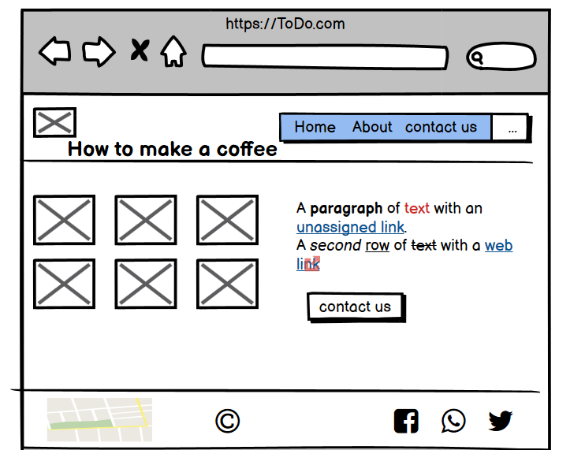

# todo-project

What observations or questions do you have about what you have learned so far?

Nothing is clear

How long did it take you to complete this assignment? And, before you started, how long did you think it would take you to complete this assignment?
15 minutes to complete the task

I thought it would take more time, but after understanding the task and reviewing what was done, I was able to solve it in the least time.
